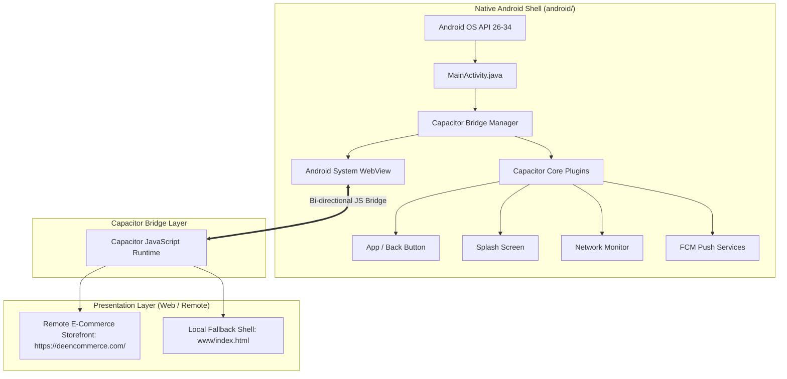
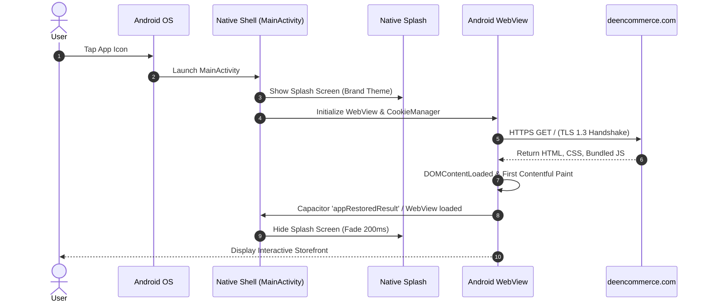
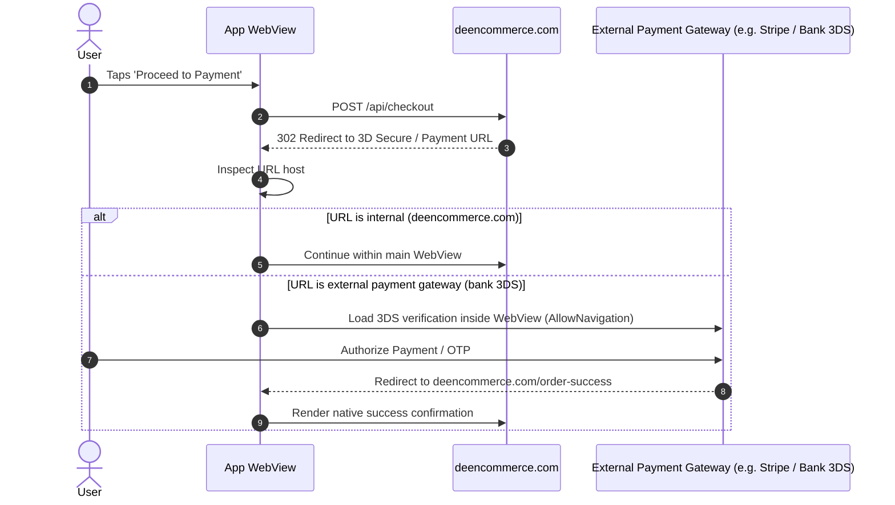

*System architecture specification, runtime bridge mechanics, data flows, security topography, and build pipelines.*

# ARCHITECTURE.md — System Architecture & Bridge Mechanics

---

## 📑 Table of Contents

- [1. Architectural Overview](#1-architectural-overview)
- [2. Component & Layer Breakdown](#2-component--layer-breakdown)
- [3. Runtime Data Flows](#3-runtime-data-flows)
  - [3.1 Cold Boot & Page Load Flow](#31-cold-boot--page-load-flow)
  - [3.2 User Authentication & Session Persistence Flow](#32-user-authentication--session-persistence-flow)
  - [3.3 Checkout & Payment Gateway Navigation Flow](#33-checkout--payment-gateway-navigation-flow)
  - [3.4 Hardware Back Navigation Intercept Flow](#34-hardware-back-navigation-intercept-flow)
  - [3.5 Deep Linking & App Link Resolution Flow](#35-deep-linking--app-link-resolution-flow)
- [4. Capacitor Configuration Anatomy](#4-capacitor-configuration-anatomy)
- [5. Plugin Bridge & Native Extension Architecture](#5-plugin-bridge--native-extension-architecture)
- [6. Web-Side Architecture & Bridge Awareness](#6-web-side-architecture--bridge-awareness)
- [7. Security Topography & WebView Hardening](#7-security-topography--webview-hardening)
- [8. Build, Compilation & Packaging Pipeline](#8-build-compilation--packaging-pipeline)
- [9. Multi-Environment Topology](#9-multi-environment-topology)
- [10. Failure Modes, Edge Cases & Mitigations](#10-failure-modes-edge-cases--mitigations)

---

## 1. Architectural Overview

**DEEN Commerce Android** implements a hybrid mobile architecture using **Capacitor 6+**. The application embeds a native Android `WebView` that connects to the live production server (`https://deencommerce.com/`), while executing a bidirectional JavaScript-to-Native bridge.



---

## 2. Component & Layer Breakdown

### 2.1 Native Android Shell (`android/`)
- **`MainActivity.java`:** Extends `com.getcapacitor.BridgeActivity`. Serves as the single native activity hosting the Capacitor bridge.
- **`AndroidManifest.xml`:** Declares app metadata, Android permissions (`INTERNET`, `ACCESS_NETWORK_STATE`), screen orientation rules, and intent filters.
- **Hardware Acceleration:** Enabled at the application level (`android:hardwareAccelerated="true"`) to ensure 60fps rendering in the WebView.

### 2.2 Bridge Runtime Layer
- The Capacitor Bridge serializes calls between JavaScript and native Java/Kotlin methods via Android's `JavascriptInterface` and message-passing channels.
- Provides standard event dispatching for Android hardware triggers (back button, app pause/resume, network state changes).

### 2.3 Remote Presentation Layer
- Live web client hosted at `https://deencommerce.com/`.
- Built as a responsive modern web application (e.g., Next.js / React / Shopify storefront).
- Capable of detecting the presence of `window.Capacitor` to toggle native-only behaviors.

### 2.4 Local Fallback Shell (`www/`)
- Contains a lightweight, zero-dependency static HTML/CSS/JS shell bundled inside the APK assets.
- If network connection is unavailable on cold launch, the WebView falls back to this local bundle to prevent native browser error screens.

---

## 3. Runtime Data Flows

### 3.1 Cold Boot & Page Load Flow



### 3.2 User Authentication & Session Persistence Flow

1. User enters credentials in the web storefront login form.
2. Web client transmits credentials via HTTPS to the authentication API endpoint.
3. Server issues `Set-Cookie` headers containing session identifiers (`HttpOnly; Secure; SameSite=Lax`).
4. Android `CookieManager` intercepts and synchronizes cookies to persistent SQLite storage (`/data/data/com.deencommerce.app/app_webview/Cookies`).
5. Upon app process termination and subsequent relaunch, `CookieManager.getInstance().flush()` ensures cookies persist, bypassing login prompts.

### 3.3 Checkout & Payment Gateway Navigation Flow



### 3.4 Hardware Back Navigation Intercept Flow

1. User taps the physical Android back button or triggers the back swipe gesture.
2. Android OS dispatches `onBackPressed()` to `MainActivity`.
3. Capacitor Bridge emits `backButton` event into the JavaScript runtime.
4. If `window.history.length > 1` and current route is not root `/`:
   - Bridge calls `window.history.back()`.
5. If user is currently at root `/`:
   - System prompts toast: *"Press back again to exit"* or calls `App.exitApp()`.

### 3.5 Deep Linking & App Link Resolution Flow

1. User clicks `https://deencommerce.com/product/linen-thobe` in an external app (e.g., WhatsApp).
2. Android OS checks verified Digital Asset Links (`.well-known/assetlinks.json`).
3. OS launches `MainActivity` with intent data URI.
4. Capacitor extracts URI in `appUrlOpen` event listener.
5. WebView navigates directly to `/product/linen-thobe`.

---

## 4. Capacitor Configuration Anatomy

The bridge is configured via `capacitor.config.ts`:

```typescript
import { CapacitorConfig } from '@capacitor/cli';

const config: CapacitorConfig = {
  appId: 'com.deencommerce.app',
  appName: 'DEEN Commerce',
  webDir: 'www',
  bundledWebRuntime: false,
  server: {
    // Primary remote storefront URL loaded directly into native WebView
    url: 'https://deencommerce.com/',
    cleartext: false, // Strict HTTPS enforcement
    allowNavigation: [
      'deencommerce.com',
      '*.deencommerce.com',
      '*.stripe.com', // Payment processors
      '*.paypal.com',
    ],
  },
  android: {
    allowMixedContent: false, // Disallow insecure HTTP content inside HTTPS
    captureInput: true,       // Ensures smooth soft-keyboard handling
    webContentsDebuggingEnabled: false, // Automatically enabled only in debug builds
    backgroundColor: '#0A4D3C', // Matches brand splash
  },
  plugins: {
    SplashScreen: {
      launchShowDuration: 3000,
      launchAutoHide: false, // Controlled programmatically via JavaScript
      backgroundColor: '#0A4D3C',
      androidSplashResourceName: 'splash',
      showSpinner: false,
    },
  },
};

export default config;
```

---

## 5. Plugin Bridge & Native Extension Architecture

Capacitor plugins expose native Android Java methods to the web runtime through annotations:

```
JavaScript Client (WebView)
       │
       │ Capacitor.Plugins.MyPlugin.actionMethod({ param: 'value' })
       ▼
Capacitor JNI / JavascriptInterface Bridge
       │
       │ (JSON deserialization to JSObject)
       ▼
Android Plugin Class:
@CapacitorPlugin(name = "MyPlugin")
public class MyPlugin extends Plugin {
    @PluginMethod
    public void actionMethod(PluginCall call) {
        String val = call.getString("param");
        // Execute native Android SDK work
        JSObject ret = new JSObject();
        ret.put("status", "success");
        call.resolve(ret);
    }
}
```

---

## 6. Web-Side Architecture & Bridge Awareness

The remote storefront identifies when it is running inside the Capacitor Android container:

```typescript
import { Capacitor } from '@capacitor/core';
import { App } from '@capacitor/app';

// Detect if running as native mobile app
export const isMobileApp = Capacitor.isNativePlatform();
export const getPlatform = Capacitor.getPlatform(); // 'android' | 'ios' | 'web'

// Register hardware back button listener
if (isMobileApp && getPlatform === 'android') {
  App.addListener('backButton', ({ canGoBack }) => {
    if (canGoBack) {
      window.history.back();
    } else {
      App.exitApp();
    }
  });
}
```

---

## 7. Security Topography & WebView Hardening

1. **Cleartext Traffic Disabled:** `android:usesCleartextTraffic="false"` declared in manifest.
2. **File Access Blocked:** Disables local file scheme navigation (`setAllowFileAccess(false)`, `setAllowContentAccess(false)`).
3. **Safe Browsing Enabled:** Android WebView Safe Browsing API enabled to catch malicious phishing or malware domains.
4. **Code Minification (R8):** Production release builds run ProGuard/R8 to obfuscate native code and strip unused symbols.

---

## 8. Build, Compilation & Packaging Pipeline

```text
[Developer / CI Git Commit]
           │
           ▼
[npm run build] ───────────► Compiles local fallback assets into www/
           │
           ▼
[npx cap sync android] ────► Copies configs, plugins & www/ into android/app/src/main/assets/
           │
           ▼
[Gradle Build Daemon]
   ├── AAPT2 compiles XML resources & drawables
   ├── javac / kotlinc compiles MainActivity & Capacitor plugins
   ├── D8/R8 performs desugaring, tree shaking & dexing
           │
           ▼
[Artifact Output]
   ├── assembleDebug   ───► android/app/build/outputs/apk/debug/app-debug.apk
   └── bundleRelease   ───► android/app/build/outputs/bundle/release/app-release.aab
```

---

## 9. Multi-Environment Topology

| Variable / Parameter | Local Development | Staging Environment | Production Environment |
| :--- | :--- | :--- | :--- |
| **`server.url`** | `http://10.0.2.2:3000` (Emulator) | `https://staging.deencommerce.com/` | `https://deencommerce.com/` |
| **App Identifier** | `com.deencommerce.app.dev` | `com.deencommerce.app.staging` | `com.deencommerce.app` |
| **App Name** | DEEN Dev | DEEN Staging | DEEN Commerce |
| **WebView Debugging** | Enabled (`true`) | Enabled (`true`) | Disabled (`false`) |
| **Cleartext HTTP** | Allowed for local IP | Prohibited | Prohibited |

---

## 10. Failure Modes, Edge Cases & Mitigations

| Failure Mode | Root Cause | Impact | Automated Mitigation |
| :--- | :--- | :--- | :--- |
| **Zero Network on Boot** | Device in airplane mode or subway | Remote page fails to load | WebView redirects to local `file:///android_asset/public/index.html` with offline retry CTA. |
| **SSL Handshake Failure** | Intermediate certificate expiry or clock drift | Secure connection refused | WebView fails safely; displays branded security alert rather than bypassing TLS. |
| **WebView Process Death** | Low RAM pressure triggers OS process kill | Screen flashes blank | Implement `onRenderProcessGone()` in `BridgeWebViewClient` to reload clean state. |
| **Session Cookie Wipe** | OS low-disk cache cleanup | User logged out unexpectedly | Explicitly call `CookieManager.getInstance().flush()` upon order completion and app backgrounding. |

---

*See also: [DEPLOYMENT.md](./DEPLOYMENT.md) for production release instructions and [TROUBLESHOOTING.md](./TROUBLESHOOTING.md) for runtime debugging.*
